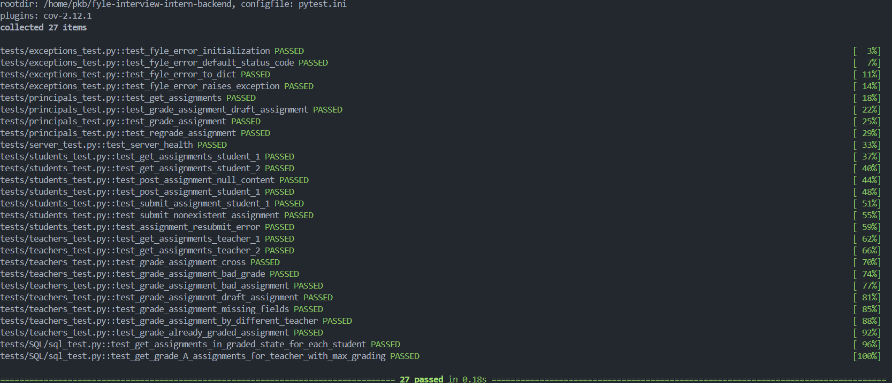
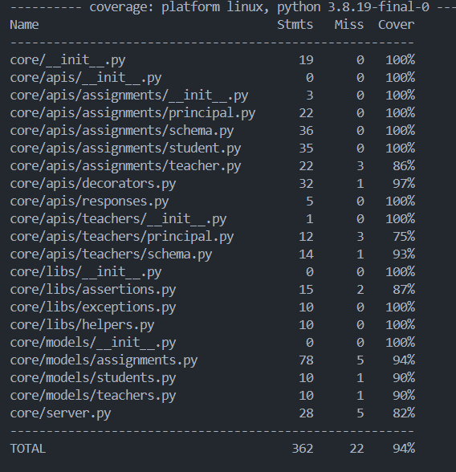

# Fyle Backend Challenge

This repository contains the backend code for the Fyle interview intern challenge.

## Test Cases




## Test Coverage



## Installation

### Option 1: Local Installation

**1. Clone the Repository**

You can set up the project locally using either a virtual environment or Docker.

```bash
git clone https://github.com/Raghav1909/fyle-interview-intern-backend
```

```bash
cd fyle-interview-intern-backend
```

**2. Set Up a Virtual Environment**

```bash
virtualenv env --python=python3.8
```

```bash
source env/bin/activate
```

**3. Install Dependencies**

```bash
pip install -r requirements.txt
```


**4. Reset DB**

```bash
export FLASK_APP=core/server.py
```

```bash
rm core/store.sqlite3
```

```bash
flask db upgrade -d core/migrations/
```

**5. Start Server**

```bash
bash run.sh
```

**6. Run Tests**

```bash
pytest -vvv -s tests/
```

**7. For test coverage report**

```bash
pytest --cov
```

### Option 2: Docker Installation

**1. Clone the Repository**

```bash
git clone https://github.com/Raghav1909/fyle-interview-intern-backend
```

```bash
cd fyle-interview-intern-backend
```

**2. Build the Docker Image**

```bash
docker build -t fyle-backend .
```

**3. Run the Docker Container**

```bash
docker run -p 7755:7755 fyle-backend
```


**4. Run Tests in Docker**
```bash
docker exec -it <container_id> pytest -vvv -s tests/
```